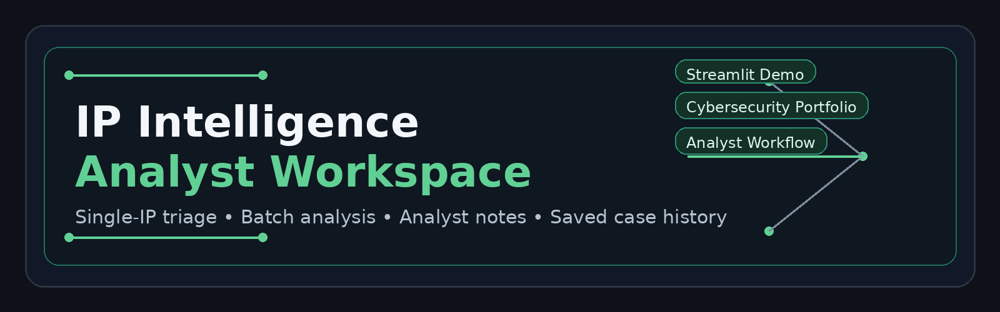

# IP Intelligence Analyst Workspace
[](https://ip-intel-analyst-workspace.streamlit.app/)  [](https://eliza-ochoa.github.io/)

An interactive cybersecurity analyst workspace that supports single-IP and batch-IP investigation, lightweight risk scoring, analyst tagging, and persistent case history. Designed to simulate real-world SOC and GRC workflows with data visualization and export capabilities.

## Features

- Single IP investigation
- Batch CSV investigation
- Public/private IP classification
- Lightweight risk scoring and flags
- Analyst tagging (`benign`, `needs_review`, `suspicious`, `malicious`)
- Analyst notes and local case history
- Exportable CSV results
- Streamlit-ready dark theme
- Portfolio/demo friendly structure

## Project Structure

```text
IP-Intel-Analyst-Workspace/
├─ app.py
├─ requirements.txt
├─ README.md
├─ .gitignore
├─ assets/
│  └─ banner.png
├─ data/
│  └─ investigations.csv
├─ ip_intel/
│  ├─ __init__.py
│  ├─ service.py
│  └─ storage.py
└─ .streamlit/
   └─ config.toml
```

## Local Setup

1. Create and activate a virtual environment.
2. Install dependencies:
   ```bash
   pip install -r requirements.txt
   ```
3. Create a `.env` file in the repo root:
   ```env
   IPINFO_TOKEN=your_ipinfo_token_here
   MAXMIND_CITY_DB=
   ```
4. Run the app:
   ```bash
   python -m streamlit run app.py
   ```

## Batch CSV Format

Your input CSV must contain a column named `ip`.

Example:

```csv
ip
8.8.8.8
1.1.1.1
208.67.222.222
```

## Deployment to Streamlit Community Cloud

1. Push this repository to GitHub.
2. In Streamlit Community Cloud, create a new app from the repository.
3. Set the main file path to:
   ```text
   app.py
   ```
4. Add your `IPINFO_TOKEN` as a Streamlit secret or environment variable before deployment.


## Analyst Workflow (Built-In)

1. Input IP(s)
2. Enrich with intelligence data
3. Evaluate risk score
4. Review indicators
5. Tag (benign / suspicious / malicious)
6. Add notes
7. Save to workspace
8. Export results


## Future Enhancements

- Threat intelligence API integration (AbuseIPDB / VirusTotal)
- Case-based investigation tracking
- Timeline analytics for recurring IPs
- Automated reporting (PDF generation)
- Multi-user collaboration support


## 🛠️ Known Issues & Limitations

- API responses may vary depending on rate limits or availability  
- Risk scoring is heuristic-based and intended for demonstration purposes  
- Batch processing performance depends on API response time  
- Geolocation accuracy may vary by IP source  


## 🐛 Reporting Issues

If you encounter any issues or bugs, please open an issue in this repository.


## ⚠️ Disclaimer

- `data/investigations.csv` is intended for local demo data only 
- Risk scoring is heuristic-based and for demonstration purposes only
- Not intended for production threat attribution
- Do not store sensitive or classified investigation data


## 🤝 Usage Notice

This project is part of a professional cybersecurity portfolio. Reuse is permitted under license, but attribution is required. This project is for educational and demonstration purposes only.


© 2026 Eliza Ochoa - TANO Research
